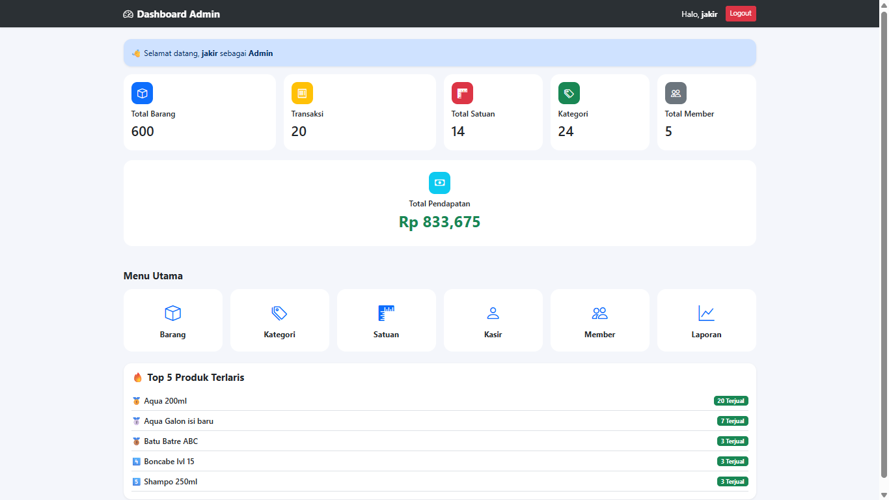
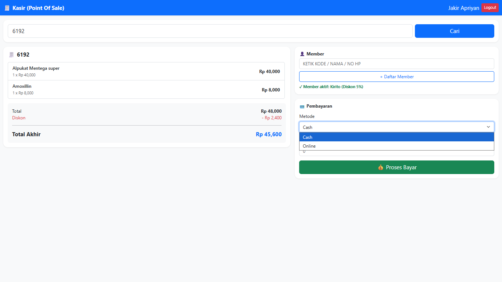
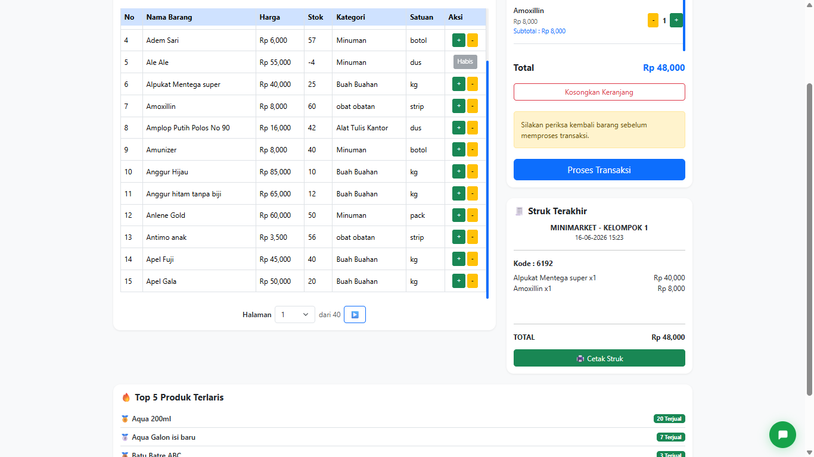
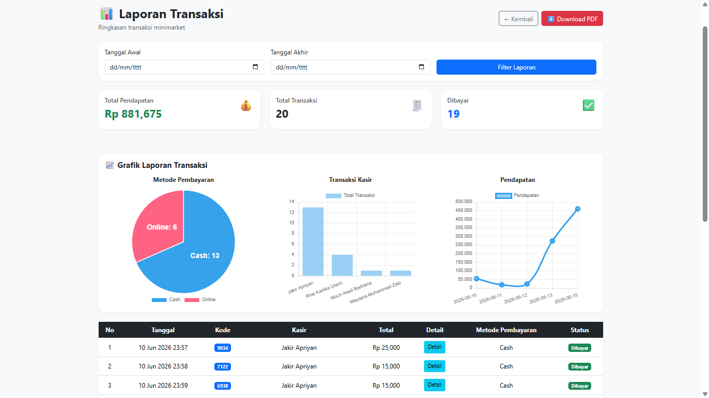

# 🛒 Minimarket Viora -Point Of Sale System

<div align="center">


### Modern Point of Sale (POS) System for Minimarket

Sistem Kasir Minimarket berbasis **PHP Native**, **MySQL**, dan **Bootstrap 5** yang dirancang untuk membantu pengelolaan transaksi, stok barang, laporan penjualan, dan manajemen pengguna secara real-time.

</div>

---

## ✨ Features

### 📦 Manajemen Barang

* Tambah barang
* Edit barang
* Hapus barang
* Pencarian barang
* Manajemen stok
* Status stok habis & stok menipis

### 🏷️ Kategori & Satuan

* CRUD kategori
* CRUD satuan
* Relasi kategori dengan barang
* Relasi satuan dengan barang

### 👥 Manajemen Pengguna

* Login Multi User
* Admin
* Kasir
* Role Based Access Control

### 💳 Sistem Transaksi

* Transaksi Penjualan
* Keranjang Belanja
* Cetak Struk
* Riwayat Transaksi
* Detail Transaksi

### 🎁 Membership

* Data Member
* Diskon Member
* Riwayat Pembelian

### 📊 Dashboard Analytics

* Total Barang
* Total Kategori
* Total Satuan
* Total Kasir
* Total Member
* Total Penjualan
* Grafik Penjualan
* Ringkasan Performa Toko

### 🏆 Best Seller Ranking

* Top 5 Produk Terlaris
* Ranking Berdasarkan Jumlah Penjualan
* Total Produk Terjual
* Monitoring Produk Favorit Pelanggan
* Tabel Best Seller Real-Time
* Analisis Produk Terpopuler

### 📈 Laporan

* Laporan Harian
* Laporan Bulanan
* Laporan Tahunan
* Export Data Penjualan
* Rekap Transaksi

### 💸 Payment Gateway

* Midtrans Integration
* QRIS
* E-Wallet
* Bank Transfer

---

# 🏗️ Tech Stack

| Technology  | Description         |
| ----------- | ------------------- |
| PHP Native  | Backend             |
| MySQL       | Database            |
| Bootstrap 5 | Frontend UI         |
| JavaScript  | Interactivity       |
| Chart.js    | Dashboard Analytics |
| Midtrans    | Payment Gateway     |
| GitHub      | Version Control     |

---

# 📊 System Overview

```text
Admin
│
├── Dashboard
├── Data Barang
├── Data Kategori
├── Data Satuan
├── Data Kasir
├── Data Member
├── Laporan
└── Monitoring Penjualan

Kasir
│
├── Transaksi
├── Cari Barang
├── Cetak Struk
└── Riwayat Transaksi
```

---

# 🗄️ Database Structure

```text
pengguna
│
├── admin
└── kasir

barang
│
├── kategori
└── satuan

transaksi
│
├── detail_transaksi
└── member
```

---

# 📸 Preview

## Dashboard Admin



## kasir



## Halaman Pembeli



## Laporan



---

# 🚀 Installation

### Clone Repository

```bash
git clone https://github.com/username/vioramart-pos.git
```

### Masuk Folder Project

```bash
cd kasir-minimarket
```

### Import Database

Import file:

```bash
kasir_minimarket.sql
```

ke MySQL.

### Konfigurasi Database

```php
<?php

$host = "localhost";
$user = "root";
$pass = "";
$db   = "kasir_minimarket";

$koneksi = mysqli_connect(
    $host,
    $user,
    $pass,
    $db
);
```

### Jalankan Project

```bash
http://localhost/kasir-minimarket
```

---

# 🔐 User Roles

| Role   | Access              |
| ------ | ------------------- |
| Admin  | Full Access         |
| Kasir  | Transaksi & Riwayat |
| Member | Diskon Pembelian    |

---

# 📈 Project Statistics

| Module         | Status |
| -------------- | ------ |
| Authentication | ✅      |
| Dashboard      | ✅      |
| Barang         | ✅      |
| Kategori       | ✅      |
| Satuan         | ✅      |
| Kasir          | ✅      |
| Member         | ✅      |
| Transaksi      | ✅      |
| Best Seller    | ✅      |
| Reports        | ✅      |
| Midtrans       | ✅      |

---

# 🌟 Future Development

* Barcode Scanner
* Multi Outlet
* Mobile App
* Telegram Notification
* AI Sales Prediction
* WhatsApp Receipt

---

# 👨‍💻 Developer - Kelompok 1

* Jakir Apriyan - 2406004
* Moch. Asad Badriana - 2406126
* Rise Kartika Utami - 2406009
* Maulana Muhammad Zaki - 2406028

Teknik Informatika
Institut Teknologi Garut

---

# ⭐ Support

Jika project ini membantu Anda:

🌟 Berikan Star pada repository GitHub ini.

🍴 Fork project untuk pengembangan lebih lanjut.

📢 Bagikan kepada teman dan komunitas developer lainnya.

---

<div align="center">

### Minimarket Viora POS System

Built with ❤️ using PHP & MySQL

</div>
